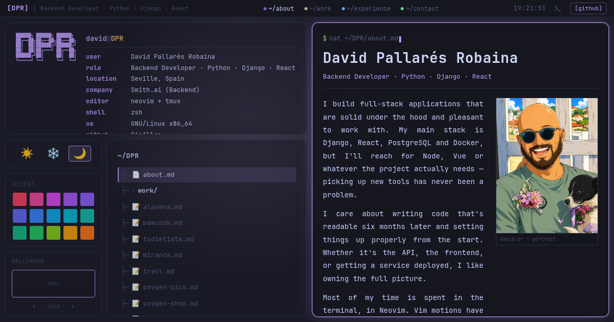

# David Pallarés Robaina — Portfolio

A terminal / Linux-ricing themed developer portfolio — tiling-WM layout, a
neofetch panel, switchable themes, and a real interactive shell.

🌐 **Live:** https://serallap.com



## Features

- **Tiling-WM desktop layout** — Neofetch · Navigation tree · Content · Theme · Accent · Wallpaper tiles.
- **Three themes** (Tokyo Night · Nord · Solarized Light) + a 15-colour accent palette and selectable wallpapers, all persisted to `localStorage`.
- **Interactive terminal** (press `` ` ``) — `help`, `ls`, `cat`, `open`, `theme`, `whoami`, `neofetch`, `history`, `man`, `repo`, `matrix`, … with command history, Tab completion and easter eggs.
- **Command palette** — ⌘/Ctrl-K fuzzy navigation to any section, project or action.
- **Generated résumé** — a real PDF built from the site's own data (jsPDF), downloadable in one click.
- **Work showcase** — image-led project cards with a flagship feature card, tech filtering, prev/next navigation, and live GitHub stats (stars / language / last push).
- **`git log`-style experience timeline** with remote / on-site chips.
- **Responsive** single-column mobile layout with a slide-in settings drawer.
- **Accessible & polished** — keyboard focus traps, skip link, `prefers-reduced-motion`, theme-aware everything, lazy-loaded overlays, installable PWA.

## Tech

- React 18 + Vite + TypeScript
- Pure CSS with custom properties (no CSS-in-JS)
- `jspdf` (résumé), `react-icons`, JetBrains Mono (self-hosted)

## Keyboard shortcuts

| Key | Action |
| --- | --- |
| `` ` `` | toggle the terminal |
| `⌘ / Ctrl + K` | command palette |
| `Tab` / `Shift+Tab` | cycle focus between tiles |
| `↑ ↓ ↵` | navigate / open within the file tree |
| `Esc` | close any overlay |

## Develop

Prerequisites: Node 22+.

```bash
npm install
npm run dev        # start the dev server
npm run build      # typecheck + production build
npm run lint       # eslint
npm run preview    # preview the production build
```

Deployment is automatic via Cloudflare on push to `main`.

## Credits

Design, layout concept, theme system, ASCII-art style, CSS architecture, wallpapers,
and JetBrains Mono font setup are derived from **[dleer-portfolio](https://github.com/dleerdefi/dleer-portfolio)**
by **[David Leer (@dleerdefi)](https://github.com/dleerdefi)**, released under the MIT License.

## License

MIT — see [LICENSE](./LICENSE)
